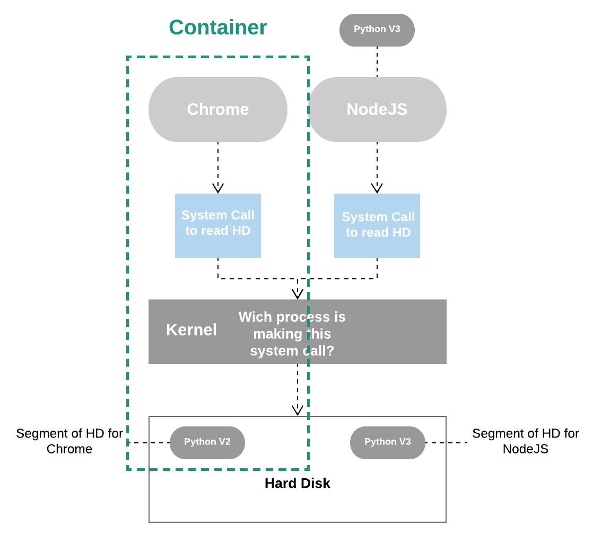

Let’s start with one important question: why use Docker?

Have you ever tried to install a software that looked simple and easy according with the instructions on the website and for some reason you got an error? If yes, you must be passed by this flow:

<figure>
	
</figure>

If you have never been through this, you can try to install a software with me right now. So, we’re going to install a software called Redis, that is an in-memory data store. In theory, we just need to follow the instructions to install on our local machine which the documentation says is as running a command (assuming you are using some Unix-based system). I ran it inside my terminal and guess what? I got an error message. And probably you did too. The error was complaining about a program that I didn’t install on my computer before. 
This is what Docker is trying to fix. Docker wants to make it effortlessly and straightforward for you to install and run software on any given computer, not just your personal computer but web servers as well. Using docker in this case I just need to run the command ‘docker run -it redis’ and almost instantaneously I have an instance of Redis up and running on my computer. Answering our initial question, the reason to use Docker is that it makes really easy to install and run software without worrying about setup or dependencies.

## Docker Ecosystem

<figure>
	
</figure>

This pieces above compose a Docker ecosystem. Docker is a platform or ecosystem around creating and running containers. I guess that your immediate question might be, well, what’s a container?
What happened when I ran the command to install Redis on my computer is that, behind the scenes, something called Docker CLI reached out to the Docker Hub and downloaded a file called “image”. An image is a single file containing all the dependencies and all the configuration required to run a specify program. At some point in time, you can use images to create containers which are instances of those images. You can think of it as being a running program with its own isolated set of hardware resources. So, it has its own little memory heap, network technology and hard drive space as well.

<figure>
	
</figure>

At this point, in order to fully harness this power in your machine you need to install some software that allows you to work directly with images and containers. You need to install this little piece of software called Docker for Windows or Docker for Mac depending upon you operating system. Inside of this program are two very important tools. The first tool  inside this package is the Docker Command Line Interface (Docker CLI), that you are going to interact with quite a bit from your terminal. So, that’s pretty much a tool to help you interact to another software called Docker Server. The Docker Server is responsible for creating containers, images and doing just about everything you can possibly imagine around the world of Docker.

<figure>
	
</figure>

After installing the Docker, you can run this command in your terminal: ‘docker run hello-world’ and you can see a little Hello from Docker message. You can see, as well, some steps that Docker use to generate this message, I’m showing below:

<figure>
	
</figure>

When you run the command ‘docker run hello-world’ in your terminal, the Docker CLI communicates with the Docker Server and checks in the image cache if you have already downloaded the ‘hello-world’ image. If not, it will look for this in a free repository of images called Docker Hub. With the image, it’s time for Docker to create an instance of a container. So, the Docker Server essentially takes that single file, loads it up into memory, creates a container out of it and then run inside of it.

## Two steps back to understand containers

To understand the container you need first a little bit of background on exactly how your operating system runs on your computer. Most operating systems have something called Kernel, that is a running software process that governs access between all programs  running on your computer and all the physical hardware connected to your computer as well. The programs interact with the Kernel through the something called System Call, that is essentially like function invocations. The Kernel exposes different end points (e.g. an end point to write a file on the disk) and just need to receive some information and call the Hard Disk to do this.

<figure>
	
</figure>

Ok, now, we’re going to suppose that you have two programs on you computer, Chrome and NodeJS and that Chrome needs Python V2 installed and NodeJS needs Python V3. Again, it’s just a supposition, they don’t actually need it. However, on your Hard Disk you only have access to Python Version 2 and for whatever crazy reason we are not allowed to have two identical installations of Python at the same time. So, as it stands right now, Chrome would work properly because it has access to version 2 and NodeJS would not because you don’t have a version or copy of Python V3. 

## How can we solve this?

One way to do it would be using an operating system feature knows as namespacing. With namespacing we can look at all the different hardware resources connected to our computer and essentially segment out portions of those resources, so we could create a segment of our Hard Disk specifically dedicated to housing Python Version 2 and a second segment specifically dedicated to housing Python Version 3. Then to make sure that Chrome and NodeJS have access to the correct segment, anytime that either them issues a System Call to read information off the Hard Drive, the Kernel will look at the incoming System Call and try to figure out which process it is coming from directing the call to the  corresponding segment of the Hard Disk. Using the segment feature we can have the ability to make sure that Chrome and NodeJS are able to work on the same machine. 

<figure>
	
</figure>

This entire process of segmenting hardware resources based on the process asking for it, is known as namespacing. With this we can isolate resources per a process or group of processes and anytime a particular process asks for resources we’re going to direct it to it's little specific area of the given piece of the hardware.

<figure>
	
</figure>

The section where we have the running process plus a little segment of resource that it can talk to is what we refer to as a container. So, when we talk about container, you should not think of these as being a physical construction that exists inside of your computer. Instead, a container is really a logical construction consisting of process or a set of processes that have a group of resources specifically assigned to it.

<figure>
	
</figure>

## How does an image create a container?

When we talk about image, we’re really talking about a File System Snapshot. A snapshot is the state of a system at a particular point in time. The term was coined as an analogy to that in photography. It can refer to an actual copy of the state of a system or to a capability provided by certain systems. So, this is essentially a copy-paste of a very specific set of directories or files. First off, the Kernel is going to isolate a little section of the Hard Drive and make it available to this container. Then, the file snapshot inside the image is taken and placed into that little segment of Hard Drive. The startup command is executed and a new instance of that process is created.

<figure>
	
</figure>

Ok, now you have knowledge enough to understand one more thing…

## How is possible the Docker run in your computer?

Well, at this point I suppose that you already have installed Docker on your computer, right? When you did this, a Linux Virtual Machine was installed as well. The features used to create containers that I mentioned before, namespacing and control groups are both features of the Linux Operational System, so we need it as well. Inside this Virtual Machine is where all these containers are going to be created and the Linux Kernel is going to host all running processes inside of containers and limit or isolate access to different hardware resources on your computer.

## Conclusion

After all of this, we have a lot of information about Docker and how it works. We know that Docker goals are to isolate an application and it’s dependencies into a container that can run anywhere, solving then our problem with software installations and dependencies. I hope this document helped you and maybe next time we can move on to a more complex example of the use of the Docker. See you.